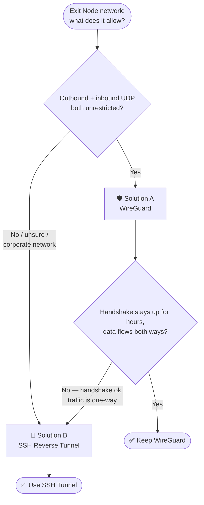
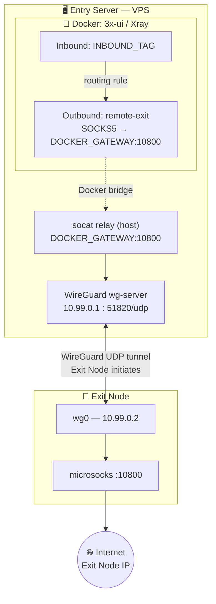
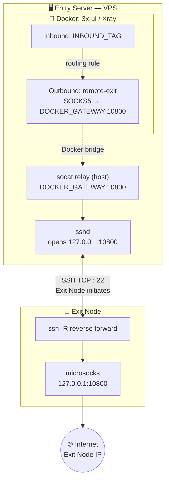
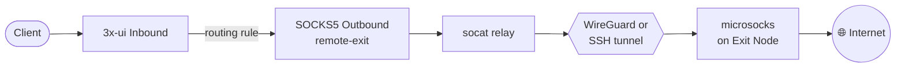
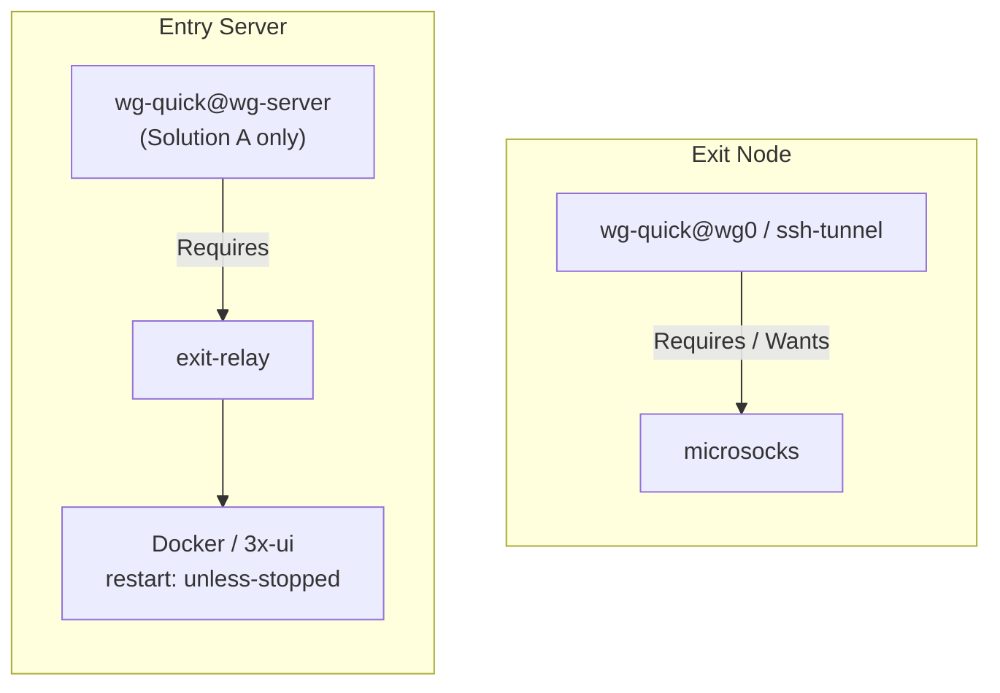

<div align="center">

# 🔀 Reverse Exit Tunnel for 3x-ui

**Route Xray inbound traffic through a remote node that has no public IP**

*WireGuard · SSH Reverse Tunnel · microsocks · socat · Docker · 3x-ui*

<br>

[](https://www.wireguard.com/)
[](https://www.openssh.com/)
[](https://www.docker.com/)
[](https://ubuntu.com/)
[](https://github.com/MHSanaei/3x-ui)
[](LICENSE)
[](https://github.com/)

<br>

🌐 **Language:** English · [Русский](README.ru.md)

</div>

---

## 📖 Overview

**Problem:** 3x-ui runs in Docker on a VPS (Entry Server). You need specific inbounds to exit the internet through a different machine (Exit Node) — one that has **no static or public IP**.

**Solution:** The Exit Node initiates a tunnel *outward* to the Entry Server. Xray on the Entry Server routes selected inbounds through a `socat` relay → tunnel → `microsocks` on the Exit Node.

Two tunnel implementations are covered — pick based on what your Exit Node's network allows:



| | Solution A · WireGuard | Solution B · SSH Reverse |
|---|---|---|
| **Best for** | Home server, VPS, unrestricted network | Corporate network, NAT, strict firewall |
| **Protocol** | UDP | TCP |
| **Port on Entry Server** | 51820/UDP | 22/TCP *(already open)* |
| **Stability** | ★★★★★ on open networks | ★★★★☆, self-healing |
| **Setup complexity** | Medium | Low |
| **Survives strict NAT / corporate firewall** | ❌ Often blocked one-way | ✅ TCP handshake passes through |

> [!TIP]
> Not sure which to pick? Start with Solution A. If `wg show` reports a handshake but `curl` through the tunnel times out — and `tcpdump` on the Exit Node shows **zero incoming packets** — your network allows outbound UDP but blocks the return traffic. That's the signature of a one-way-blocked corporate firewall. Skip straight to Solution B below.

---

## 🏗️ Architecture

### Solution A — WireGuard



### Solution B — SSH Reverse Tunnel



### Traffic Flow (either solution)



> [!NOTE]
> Both solutions share the exact same Docker / socat / 3x-ui configuration — only the tunnel transport (UDP vs TCP) differs. That's intentional: it lets you migrate between them without touching 3x-ui at all.

---

## ✅ Prerequisites

| | Entry Server | Exit Node |
|---|---|---|
| **OS** | Ubuntu 22.04+ | Ubuntu 22.04+ |
| **Network** | Public IP, Docker + 3x-ui running | Internet access only — **no public IP needed** |
| **Required open ports** | 22/TCP, 443/TCP, + **51820/UDP** *(Solution A only)* | None |

---

## 📋 Variable Reference

Replace these placeholders throughout the guide with your real values:

| Variable | Description | How to find it |
|----------|-------------|-----------------|
| `<ENTRY_SERVER_IP>` | Entry Server public IP | `curl ifconfig.me` on Entry Server |
| `<DOCKER_GATEWAY>` | Docker bridge gateway | `docker exec <container> ip route \| grep default` |
| `<BR_IFACE>` | Docker bridge interface name | `ip link show \| grep br-` |
| `<INBOUND_TAG>` | Xray inbound tag in 3x-ui | Visible in Xray JSON config |
| `<EXIT_NODE_USER>` | Linux user on the Exit Node | `whoami` on the Exit Node |

<details>
<summary>💡 How to find DOCKER_GATEWAY and BR_IFACE</summary>

```bash
# DOCKER_GATEWAY — run on Entry Server
docker exec <3x-ui-container-name> ip route | grep default
# Example: default via 172.19.0.1 dev eth0
#                      ^^^^^^^^^^ = DOCKER_GATEWAY

# BR_IFACE — match by network name
docker network ls                                    # find your compose network
docker network inspect <network-name> | grep Subnet   # confirm subnet matches DOCKER_GATEWAY
ip link show | grep br-                                # br-XXXXXXXX = BR_IFACE
```

</details>

> [!IMPORTANT]
> Before enabling **any** systemd service in this guide, confirm three things on the machine you're running it on: the placeholders are replaced with real values, the `User=` line matches the output of `whoami`, and any key/file paths actually exist. A service that silently fails with `status=217/USER` almost always means `User=` doesn't match the real account — this happened during testing, see Troubleshooting below.

---

## 🛡️ Solution A: WireGuard

> Use when the Exit Node is on a home network, VPS, or any network without UDP filtering.

### A1 — Entry Server: WireGuard server

```bash
sudo apt update && sudo apt install -y wireguard
```

Generate keys directly into `/etc/wireguard` as root — this sidesteps `cd: Permission denied` entirely, since you never need to `cd` into a root-owned directory as a regular user:

```bash
wg genkey | sudo tee /etc/wireguard/server_private.key | wg pubkey | sudo tee /etc/wireguard/server_public.key
sudo chmod 600 /etc/wireguard/server_private.key

# Save this — needed for Exit Node (Step A2)
sudo cat /etc/wireguard/server_public.key
```

Build the config in one shot, with the key pre-expanded into a shell variable:

```bash
SERVER_PRIVKEY=$(sudo cat /etc/wireguard/server_private.key)

sudo tee /etc/wireguard/wg-server.conf > /dev/null << EOF
[Interface]
PrivateKey = ${SERVER_PRIVKEY}
Address = 10.99.0.1/24
ListenPort = 51820

[Peer]
# Fill PublicKey after Step A2
PublicKey = PLACEHOLDER
AllowedIPs = 10.99.0.2/32
PersistentKeepalive = 25
EOF

sudo cat /etc/wireguard/wg-server.conf   # verify it looks right
```

> [!WARNING]
> Don't wrap this in `sudo bash -c "cat > file << EOF ... EOF"`. Nesting a heredoc inside a double-quoted `bash -c` string is fragile — a stray missing space or a terminal that reflows pasted text can silently turn `$(cat /path/to/key)` into a literal string instead of the key's contents, and WireGuard will then fail with `Key is not the correct length or format`. The pattern above (`VAR=$(...)` first, then `sudo tee file << EOF`) avoids nested quoting entirely and is the one used throughout this guide.

```bash
sudo ufw allow 51820/udp
# Don't start the service yet — you still need the Exit Node's public key
```

### A2 — Exit Node: WireGuard client + microsocks

```bash
sudo apt update && sudo apt install -y wireguard microsocks

wg genkey | sudo tee /etc/wireguard/client_private.key | wg pubkey | sudo tee /etc/wireguard/client_public.key
sudo chmod 600 /etc/wireguard/client_private.key

# Save this — copy to Entry Server
sudo cat /etc/wireguard/client_public.key
```

```bash
CLIENT_PRIVKEY=$(sudo cat /etc/wireguard/client_private.key)

sudo tee /etc/wireguard/wg0.conf > /dev/null << EOF
[Interface]
PrivateKey = ${CLIENT_PRIVKEY}
Address = 10.99.0.2/24

[Peer]
PublicKey = <ENTRY_SERVER_PUBLIC_KEY>
Endpoint = <ENTRY_SERVER_IP>:51820
AllowedIPs = 10.99.0.1/32
PersistentKeepalive = 25
EOF

sudo nano /etc/wireguard/wg0.conf
# Replace <ENTRY_SERVER_PUBLIC_KEY> and <ENTRY_SERVER_IP> with real values
```

```bash
sudo tee /etc/systemd/system/microsocks.service << 'EOF'
[Unit]
Description=microsocks SOCKS5 proxy (WireGuard exit)
After=wg-quick@wg0.service
Requires=wg-quick@wg0.service

[Service]
ExecStart=/usr/bin/microsocks -i 10.99.0.2 -p 10800
Restart=always
RestartSec=5
User=nobody

[Install]
WantedBy=multi-user.target
EOF

sudo systemctl daemon-reload
sudo systemctl enable wg-quick@wg0 microsocks
```

### A3 — Key Exchange

```bash
# On Entry Server
EXIT_PUBKEY="<PASTE_EXIT_NODE_PUBLIC_KEY>"
sudo sed -i "s|PublicKey = PLACEHOLDER|PublicKey = ${EXIT_PUBKEY}|" /etc/wireguard/wg-server.conf
sudo cat /etc/wireguard/wg-server.conf   # verify
```

### A4 — Start & Verify

```bash
# Entry Server
sudo systemctl enable --now wg-quick@wg-server

# Exit Node
sudo systemctl start wg-quick@wg0
sudo systemctl start microsocks
```

```bash
# Verify from Entry Server — both must pass:
sudo wg show wg-server                                             # latest handshake: recent ✓
curl --max-time 5 --socks5 10.99.0.2:10800 https://api.ipify.org   # returns Exit Node IP ✓
```

> [!WARNING]
> A handshake alone doesn't guarantee a working tunnel. If `curl` times out, run `sudo tcpdump -i wg0 -n` on the Exit Node while retrying `curl` from the Entry Server. **Zero packets captured** means your network accepts outbound WireGuard but blocks the return path — a classic corporate-firewall symptom. Don't keep tuning WireGuard at this point; jump to Solution B below.

### A5 — socat Relay (Entry Server)

```bash
sudo apt install -y socat

# Replace 172.19.0.1 with your actual <DOCKER_GATEWAY>
sudo tee /etc/systemd/system/exit-relay.service << 'EOF'
[Unit]
Description=socat: Docker bridge -> WireGuard -> Exit Node microsocks
After=wg-quick@wg-server.service
Requires=wg-quick@wg-server.service

[Service]
ExecStart=/usr/bin/socat \
  TCP-LISTEN:10800,bind=172.19.0.1,fork,reuseaddr \
  TCP:10.99.0.2:10800
Restart=always
RestartSec=5

[Install]
WantedBy=multi-user.target
EOF

sudo systemctl daemon-reload
sudo systemctl enable --now exit-relay

ss -tlnp | grep 10800   # must show 172.19.0.1:10800 LISTEN
```

Once the relay is listening, continue with **UFW Rule** and **3x-ui Configuration** below — they're shared by both solutions.

---

## 🔑 Solution B: SSH Reverse Tunnel

> Use when the Exit Node is behind a corporate firewall, strict NAT, or blocks UDP.

`autossh` is **not required**. A plain `ssh` client with `ServerAliveInterval`/`ServerAliveCountMax` plus systemd's `Restart=always` gives the same self-healing behavior with one less dependency. `autossh` only adds value against zombie TCP connections that keepalives can't detect — an edge case most networks don't hit. An optional autossh variant is included at the end of this section if you want it anyway.

### B1 — Exit Node: SSH key

```bash
sudo apt update && sudo apt install -y microsocks

ssh-keygen -t ed25519 -f ~/.ssh/entry_tunnel -N ""

# Save this — copy to Entry Server (Step B2)
cat ~/.ssh/entry_tunnel.pub
```

### B2 — Entry Server: Authorize the key

```bash
echo "<PASTE_EXIT_NODE_PUBLIC_KEY>" >> ~/.ssh/authorized_keys
chmod 600 ~/.ssh/authorized_keys

# Confirm it landed correctly
tail -1 ~/.ssh/authorized_keys
```

> [!NOTE]
> `GatewayPorts` in `sshd_config` is **not required** — socat connects to `127.0.0.1:10800` on the same host where `sshd` runs, so the forwarded port never needs to be exposed beyond localhost.

Before continuing, verify the connection manually from the Exit Node:

```bash
ssh -i ~/.ssh/entry_tunnel <ENTRY_SERVER_USER>@<ENTRY_SERVER_IP> echo ok
# Must print "ok" with no password prompt
```

### B3 — Exit Node: microsocks + SSH tunnel

```bash
sudo tee /etc/systemd/system/microsocks.service << 'EOF'
[Unit]
Description=microsocks SOCKS5 proxy (SSH tunnel exit)
After=network.target

[Service]
ExecStart=/usr/bin/microsocks -i 127.0.0.1 -p 10800
Restart=always
RestartSec=5
User=nobody

[Install]
WantedBy=multi-user.target
EOF
```

```bash
# Confirm your actual username first — you'll need it below
whoami
```

> [!CAUTION]
> The `User=` line below **must** match the output of `whoami` on this exact machine, and `<ENTRY_SERVER_IP>` / `<ENTRY_SERVER_USER>` / `<EXIT_NODE_USER>` must be replaced with real values, not left as literal placeholder text. A mismatched `User=` fails silently with `status=217/USER` in `systemctl status`, and a literal `<ENTRY_SERVER_IP>` simply can't resolve as a hostname. Both of these happened during testing.

```bash
# Replace <EXIT_NODE_USER>, <ENTRY_SERVER_USER>, <ENTRY_SERVER_IP> with real values
sudo tee /etc/systemd/system/ssh-tunnel.service << 'EOF'
[Unit]
Description=SSH Reverse Tunnel to Entry Server
After=network.target microsocks.service
Wants=microsocks.service

[Service]
User=<EXIT_NODE_USER>
ExecStart=/usr/bin/ssh -N \
  -o "ServerAliveInterval=10" \
  -o "ServerAliveCountMax=3" \
  -o "ExitOnForwardFailure=yes" \
  -o "StrictHostKeyChecking=no" \
  -i /home/<EXIT_NODE_USER>/.ssh/entry_tunnel \
  -R 10800:127.0.0.1:10800 \
  <ENTRY_SERVER_USER>@<ENTRY_SERVER_IP>
Restart=always
RestartSec=10

[Install]
WantedBy=multi-user.target
EOF

sudo systemctl daemon-reload
sudo systemctl enable --now microsocks
sudo systemctl enable --now ssh-tunnel

# Wait a few seconds, then check it's actually running (not auto-restarting in a loop)
sleep 3 && sudo systemctl status ssh-tunnel --no-pager
```

<details>
<summary>🔧 Optional: using autossh instead of plain ssh</summary>

If you want extra protection against zombie TCP connections (rare, but possible on some networks), swap in `autossh`:

```bash
sudo apt install -y autossh
```

Then change the `ExecStart` line to:

```ini
ExecStart=/usr/bin/autossh -M 0 -N \
  -o "ServerAliveInterval=10" \
  -o "ServerAliveCountMax=3" \
  -o "ExitOnForwardFailure=yes" \
  -o "StrictHostKeyChecking=no" \
  -i /home/<EXIT_NODE_USER>/.ssh/entry_tunnel \
  -R 10800:127.0.0.1:10800 \
  <ENTRY_SERVER_USER>@<ENTRY_SERVER_IP>
```

`-M 0` disables autossh's own monitoring port and relies purely on SSH-level keepalives — functionally close to plain `ssh`, but with autossh's additional process-level watchdog on top.

</details>

### B4 — Entry Server: socat relay

```bash
sudo apt install -y socat

# Replace 172.19.0.1 with your actual <DOCKER_GATEWAY>
# Target is 127.0.0.1 (SSH tunnel endpoint) — not a WireGuard IP
sudo tee /etc/systemd/system/exit-relay.service << 'EOF'
[Unit]
Description=socat: Docker bridge -> SSH tunnel -> Exit Node microsocks
After=network.target

[Service]
ExecStart=/usr/bin/socat \
  TCP-LISTEN:10800,bind=172.19.0.1,fork,reuseaddr \
  TCP:127.0.0.1:10800
Restart=always
RestartSec=5

[Install]
WantedBy=multi-user.target
EOF

sudo systemctl daemon-reload
sudo systemctl enable --now exit-relay

ss -tlnp | grep 10800   # must show 172.19.0.1:10800 LISTEN
```

### B5 — Verify the SSH Tunnel

```bash
# Entry Server — the forwarded port should appear within seconds of ssh-tunnel starting
ss -tlnp | grep 10800
# Expected: 127.0.0.1:10800  LISTEN   (opened by sshd on behalf of the Exit Node)

curl --max-time 5 --socks5 127.0.0.1:10800 https://api.ipify.org
# ✓ Must return the Exit Node's IP
```

Once verified, continue with **UFW Rule** and **3x-ui Configuration** below — they're shared by both solutions.

---

## ⚙️ Common: UFW Rule (both solutions)

Docker containers cannot reach `<DOCKER_GATEWAY>:10800` without an explicit UFW rule — `deny (incoming)` blocks it by default even though the traffic originates from a "local" bridge network.

```bash
docker network ls
docker network inspect <your-compose-network> | grep Subnet
ip link show | grep br-
```

```bash
# Replace br-XXXXXXXX with your actual bridge interface (<BR_IFACE>)
sudo ufw allow in on br-XXXXXXXX to 172.19.0.1 port 10800 proto tcp

sudo ufw status verbose | grep 10800
```

```bash
docker exec <3x-ui-container> nc -zv 172.19.0.1 10800
# ✓ Expected: open
```

> [!NOTE]
> Don't use `docker exec <container> curl --socks5 ...` to test this. The 3x-ui image ships **BusyBox** `curl`/`wget`, which doesn't support SOCKS5 proxying — it either errors out (`unrecognized option`) or silently connects direct, ignoring the proxy entirely. Either way, the test is meaningless. `nc -zv` checks raw TCP reachability, which is exactly what's needed at this stage; Xray itself (not BusyBox) is what actually speaks SOCKS5 once routing is configured.

---

## ⚙️ Common: 3x-ui Configuration (both solutions)

Identical for both solutions — the `<DOCKER_GATEWAY>:10800` address never changes regardless of which tunnel is underneath.

### Add SOCKS5 Outbound

**Outbounds → + Add Outbound**

| Field | Value |
|-------|-------|
| Protocol | `socks` |
| Tag | `remote-exit` |
| Address | `172.19.0.1` ← your `<DOCKER_GATEWAY>` |
| Port | `10800` |
| Username / Password | *(leave empty)* |

Click **Create** → **Save**.

<details>
<summary>JSON equivalent</summary>

```json
{
  "tag": "remote-exit",
  "protocol": "socks",
  "settings": {
    "servers": [{ "address": "172.19.0.1", "port": 10800, "users": [] }]
  }
}
```

</details>

### Add Routing Rule

**Xray Configs → Routing → + Add Rule**

| Field | Value |
|-------|-------|
| **Inbound Tags** | select your **specific** target inbound — e.g. `inbound-1080` |
| Outbound Tag | select `remote-exit` |
| Everything else | *(leave empty)* |

Click **Create** → **Save** → Xray restarts automatically.

> [!CAUTION]
> An empty **Inbound Tags** field matches **every** inbound on the server, not just the one you intend — Xray treats an unset field as "no restriction," not "none." This silently reroutes *all* VPN clients through the Exit Node, including ones that should stay direct. Always select the specific inbound explicitly, and double-check no other broader rule above it (e.g. a catch-all with an empty inbound field) is intercepting traffic first. Rule order matters too: this rule must sit **above** `direct` and `block` in the list.

<details>
<summary>JSON equivalent</summary>

```json
{
  "type": "field",
  "inboundTag": ["inbound-1080"],
  "outboundTag": "remote-exit"
}
```

</details>

---

## ✅ Final Verification

```bash
# Entry Server
sudo systemctl status exit-relay --no-pager

# Solution A only
sudo wg show wg-server                  # latest handshake: recent ✓

# Solution B only
ss -tlnp | grep 10800                   # 127.0.0.1:10800 LISTEN ✓

# Container reaches the relay
docker exec <3x-ui-container> nc -zv 172.19.0.1 10800   # open ✓

# Full end-to-end test — through the actual target inbound
curl --socks5 user:pass@<ENTRY_SERVER_IP>:<INBOUND_PORT> https://api.ipify.org
# ✓ Returns Exit Node IP, not Entry Server IP

# Sanity check — every OTHER inbound should still show the Entry Server's own IP
curl --socks5 user:pass@<ENTRY_SERVER_IP>:<OTHER_INBOUND_PORT> https://api.ipify.org
# ✓ Must return Entry Server IP — if it also returns Exit Node IP, see the
#   Inbound Tags caution above
```

---

## ♻️ Startup Order



Both sides come up automatically on reboot — systemd dependencies (`Requires=` / `Wants=`) enforce the correct order without manual intervention.

---

## 🛡️ Watchdog (recommended for Solution A)

WireGuard sessions behind NAT can go stale after long idle periods — `PersistentKeepalive` keeps packets flowing, but some corporate NATs still drop the mapping anyway. A `restart` resolves it instantly; this cron job automates that:

```bash
# Exit Node
sudo tee /usr/local/bin/wg-watchdog.sh << 'EOF'
#!/bin/bash
LAST=$(sudo wg show wg0 latest-handshakes | awk '{print $2}')
DIFF=$(( $(date +%s) - LAST ))
if [ "$DIFF" -gt 180 ]; then
    logger "wg-watchdog: stale handshake (${DIFF}s), restarting"
    systemctl restart wg-quick@wg0
fi
EOF

sudo chmod +x /usr/local/bin/wg-watchdog.sh
(sudo crontab -l 2>/dev/null; echo "*/2 * * * * /usr/local/bin/wg-watchdog.sh") | sudo crontab -
```

> [!NOTE]
> Solution B doesn't need this — `ssh` + `ServerAliveCountMax` + systemd's `Restart=always` already self-heals within ~30 seconds of any disconnect, and a TCP-based tunnel doesn't suffer from the one-way-UDP NAT problem in the first place.

---

## 🔄 Migration: WireGuard → SSH

If testing reveals your Exit Node's network blocks inbound UDP (handshake succeeds, but `tcpdump` shows zero return packets), tear down Solution A and switch to Solution B.

<details>
<summary>Cleanup commands</summary>

**Entry Server:**

```bash
sudo systemctl stop wg-quick@wg-server exit-relay
sudo systemctl disable wg-quick@wg-server exit-relay
sudo ip link delete wg-server 2>/dev/null || true
sudo rm -f /etc/wireguard/wg-server.conf \
           /etc/wireguard/server_private.key \
           /etc/wireguard/server_public.key
sudo rm -f /etc/systemd/system/exit-relay.service
sudo ufw delete allow 51820/udp
sudo systemctl daemon-reload
```

**Exit Node:**

```bash
sudo systemctl stop wg-quick@wg0 microsocks
sudo systemctl disable wg-quick@wg0 microsocks
sudo ip link delete wg0 2>/dev/null || true
sudo rm -f /etc/wireguard/wg0.conf \
           /etc/wireguard/client_private.key \
           /etc/wireguard/client_public.key
sudo rm -f /etc/systemd/system/microsocks.service
sudo systemctl daemon-reload
```

</details>

Then follow Solution B steps B1–B5 above. The UFW rule and 3x-ui configuration stay exactly as they are.

---

## 🔧 Troubleshooting

<details>
<summary>❌ <code>cd /etc/wireguard: Permission denied</code></summary>

The directory is root-owned (`0700`). Either prefix every command with `sudo`, or — better — avoid `cd` entirely and write files directly with `sudo tee`, as shown throughout this guide.

</details>

<details>
<summary>❌ WireGuard fails with <code>Key is not the correct length or format</code></summary>

This means the config file contains a literal unexpanded string (like `$(cat/etc/wireguard/...)`) instead of an actual key — almost always caused by nesting a heredoc inside `sudo bash -c "..."` with an escaped `$`. Inspect the file:

```bash
sudo cat /etc/wireguard/wg0.conf
```

If `PrivateKey =` is followed by anything other than a 44-character base64 string, regenerate the config using the `VAR=$(sudo cat key_file)` + `sudo tee file << EOF` pattern from Step A1 / A2 above — it can't suffer from this class of bug.

</details>

<details>
<summary>❌ [WG] No handshake after several minutes</summary>

```bash
sudo ufw status | grep 51820              # Entry Server: port open?
ping -c3 <ENTRY_SERVER_IP>                # Exit Node: can it reach Entry Server at all?
sudo cat /etc/wireguard/wg-server.conf    # Entry Server: keys match?
sudo cat /etc/wireguard/wg0.conf          # Exit Node: keys match?

sudo systemctl restart wg-quick@wg-server   # Entry Server
sudo systemctl restart wg-quick@wg0         # Exit Node
```

</details>

<details>
<summary>❌ [WG] Handshake succeeds but traffic only flows one way</summary>

Symptom: `wg show` reports a recent handshake and *some* bytes received on the Entry Server, but the Exit Node's `transfer` line shows almost nothing received (just the initial handshake reply, a few hundred bytes) no matter how long you wait — and `sudo tcpdump -i wg0 -n` on the Exit Node captures **zero packets** during a `curl` test from the Entry Server.

This isn't a configuration bug — it's the Exit Node's upstream firewall allowing outbound UDP (so the handshake request gets out and gets one reply) but blocking further unsolicited inbound UDP from the Entry Server's IP. Typical of corporate networks with stateful firewalls. No WireGuard setting fixes this from your side.

→ Migrate to Solution B (see Migration section above).

</details>

<details>
<summary>❌ [WG] A previously-working tunnel goes stale (handshake hours old, ping fails)</summary>

```bash
sudo wg show wg0          # check latest handshake age, on Exit Node
sudo systemctl restart wg-quick@wg0
sudo wg show wg0          # handshake should now read "X seconds ago"
```

If this keeps recurring every few hours, the NAT/firewall session is expiring faster than `PersistentKeepalive` can refresh it. Either install the watchdog above to auto-restart, or migrate to Solution B, which doesn't suffer from this since TCP connection tracking behaves differently from UDP NAT mappings.

</details>

<details>
<summary>❌ [SSH] systemd shows <code>status=217/USER</code></summary>

`217/USER` means systemd couldn't switch to the account in `User=` — almost always because that username doesn't exist on this specific machine. Check:

```bash
whoami
cat /etc/systemd/system/ssh-tunnel.service | grep User=
```

Fix the `User=` line (and the matching `/home/<user>/.ssh/...` key path) to match the real account, then:

```bash
sudo systemctl daemon-reload
sudo systemctl restart ssh-tunnel
```

</details>

<details>
<summary>❌ [SSH] ssh-tunnel fails to connect / "Name or service not known"</summary>

A literal placeholder like `<ENTRY_SERVER_IP>` was left unreplaced in the service file. Check:

```bash
sudo cat /etc/systemd/system/ssh-tunnel.service | grep ExecStart
```

Anything still wrapped in `<angle brackets>` needs a real value. Edit, then:

```bash
sudo systemctl daemon-reload
sudo systemctl restart ssh-tunnel
```

</details>

<details>
<summary>❌ [SSH] 127.0.0.1:10800 not listening on Entry Server</summary>

```bash
sudo systemctl status ssh-tunnel --no-pager
sudo journalctl -u ssh-tunnel -n 30

# Test SSH connectivity manually from Exit Node
ssh -i ~/.ssh/entry_tunnel -N -R 10800:127.0.0.1:10800 <user>@<ENTRY_SERVER_IP>
# If this fails interactively too, the problem is SSH auth, not systemd —
# check authorized_keys on Entry Server:
cat ~/.ssh/authorized_keys | grep -c "ssh-"
```

</details>

<details>
<summary>❌ <code>nc -zv DOCKER_GATEWAY 10800</code> returns "Host is unreachable" from inside the container</summary>

Missing UFW rule — UFW's default `deny (incoming)` / `deny (routed)` blocks Docker bridge traffic to the host:

```bash
sudo ufw allow in on br-XXXXXXXX to <DOCKER_GATEWAY> port 10800 proto tcp
docker exec <container> nc -zv <DOCKER_GATEWAY> 10800
```

</details>

<details>
<summary>❌ <code>docker exec ... curl --socks5 ...</code> fails or returns the Entry Server's own IP</summary>

The 3x-ui container's `curl`/`wget` is BusyBox and doesn't properly support `--socks5` — this is expected, not a sign that anything is broken. Use `nc -zv` to test raw TCP reachability instead; only Xray itself needs to actually speak SOCKS5, and it does so correctly once outbound + routing are configured in the panel.

</details>

<details>
<summary>❌ All inbounds — not just the target one — now exit through the Exit Node</summary>

The routing rule's **Inbound Tags** field was left empty, or another broader rule precedes it. An empty field in Xray routing means "match anything," not "match nothing."

```bash
# Inspect the actual rule order and inboundTag values
docker exec <container> cat /usr/local/x-ui/bin/config.json | python3 -m json.tool | grep -A5 '"routing"'
```

Fix: in 3x-ui, edit the `remote-exit` rule and explicitly select only the intended inbound under **Inbound Tags**. Re-test every *other* inbound afterward to confirm it still shows the Entry Server's own IP.

</details>

---

## 📎 Quick Reference

<details>
<summary>Solution A — full command sequence</summary>

```bash
# ── Entry Server ──────────────────────────────────────────────
sudo apt update && sudo apt install -y wireguard socat
wg genkey | sudo tee /etc/wireguard/server_private.key | wg pubkey | sudo tee /etc/wireguard/server_public.key
sudo chmod 600 /etc/wireguard/server_private.key
SERVER_PRIVKEY=$(sudo cat /etc/wireguard/server_private.key)
sudo tee /etc/wireguard/wg-server.conf > /dev/null << EOF
[Interface]
PrivateKey = ${SERVER_PRIVKEY}
Address = 10.99.0.1/24
ListenPort = 51820
[Peer]
PublicKey = <EXIT_NODE_PUBLIC_KEY>
AllowedIPs = 10.99.0.2/32
PersistentKeepalive = 25
EOF
sudo ufw allow 51820/udp
sudo systemctl enable --now wg-quick@wg-server

sudo tee /etc/systemd/system/exit-relay.service << 'EOF'
[Unit]
Description=socat relay
After=wg-quick@wg-server.service
Requires=wg-quick@wg-server.service
[Service]
ExecStart=/usr/bin/socat TCP-LISTEN:10800,bind=<DOCKER_GATEWAY>,fork,reuseaddr TCP:10.99.0.2:10800
Restart=always
[Install]
WantedBy=multi-user.target
EOF
sudo systemctl daemon-reload && sudo systemctl enable --now exit-relay
sudo ufw allow in on <BR_IFACE> to <DOCKER_GATEWAY> port 10800 proto tcp

# ── Exit Node ─────────────────────────────────────────────────
sudo apt update && sudo apt install -y wireguard microsocks
wg genkey | sudo tee /etc/wireguard/client_private.key | wg pubkey | sudo tee /etc/wireguard/client_public.key
sudo chmod 600 /etc/wireguard/client_private.key
CLIENT_PRIVKEY=$(sudo cat /etc/wireguard/client_private.key)
sudo tee /etc/wireguard/wg0.conf > /dev/null << EOF
[Interface]
PrivateKey = ${CLIENT_PRIVKEY}
Address = 10.99.0.2/24
[Peer]
PublicKey = <ENTRY_SERVER_PUBLIC_KEY>
Endpoint = <ENTRY_SERVER_IP>:51820
AllowedIPs = 10.99.0.1/32
PersistentKeepalive = 25
EOF
sudo tee /etc/systemd/system/microsocks.service << 'EOF'
[Unit]
Description=microsocks
After=wg-quick@wg0.service
Requires=wg-quick@wg0.service
[Service]
ExecStart=/usr/bin/microsocks -i 10.99.0.2 -p 10800
Restart=always
User=nobody
[Install]
WantedBy=multi-user.target
EOF
sudo systemctl daemon-reload
sudo systemctl enable --now wg-quick@wg0 microsocks
```

</details>

<details>
<summary>Solution B — full command sequence</summary>

```bash
# ── Exit Node ─────────────────────────────────────────────────
sudo apt update && sudo apt install -y microsocks
ssh-keygen -t ed25519 -f ~/.ssh/entry_tunnel -N ""
cat ~/.ssh/entry_tunnel.pub   # copy to Entry Server

sudo tee /etc/systemd/system/microsocks.service << 'EOF'
[Unit]
Description=microsocks
After=network.target
[Service]
ExecStart=/usr/bin/microsocks -i 127.0.0.1 -p 10800
Restart=always
User=nobody
[Install]
WantedBy=multi-user.target
EOF

sudo tee /etc/systemd/system/ssh-tunnel.service << EOF
[Unit]
Description=SSH reverse tunnel
After=network.target microsocks.service
Wants=microsocks.service
[Service]
User=$(whoami)
ExecStart=/usr/bin/ssh -N -o "ServerAliveInterval=10" -o "ServerAliveCountMax=3" \\
  -o "ExitOnForwardFailure=yes" -o "StrictHostKeyChecking=no" \\
  -i $HOME/.ssh/entry_tunnel -R 10800:127.0.0.1:10800 \\
  <ENTRY_SERVER_USER>@<ENTRY_SERVER_IP>
Restart=always
RestartSec=10
[Install]
WantedBy=multi-user.target
EOF
sudo systemctl daemon-reload
sudo systemctl enable --now microsocks ssh-tunnel

# ── Entry Server ──────────────────────────────────────────────
echo "<EXIT_NODE_PUBLIC_KEY>" >> ~/.ssh/authorized_keys
chmod 600 ~/.ssh/authorized_keys

sudo apt install -y socat
sudo tee /etc/systemd/system/exit-relay.service << 'EOF'
[Unit]
Description=socat relay
After=network.target
[Service]
ExecStart=/usr/bin/socat TCP-LISTEN:10800,bind=<DOCKER_GATEWAY>,fork,reuseaddr TCP:127.0.0.1:10800
Restart=always
[Install]
WantedBy=multi-user.target
EOF
sudo systemctl daemon-reload && sudo systemctl enable --now exit-relay
sudo ufw allow in on <BR_IFACE> to <DOCKER_GATEWAY> port 10800 proto tcp
```

</details>

---

## ❓ FAQ

**Q: Can I add multiple Exit Nodes for different inbounds?**
A: Yes. Each Exit Node gets its own tunnel (a separate WireGuard peer or a separate SSH port), its own `socat` relay (a different bind port), and its own outbound + routing rule in 3x-ui.

**Q: Can I use a protocol other than SOCKS5 for the outbound?**
A: Yes. Once the tunnel is up, run any proxy on the Exit Node — Xray VLESS, Shadowsocks, HTTP CONNECT — and use the matching outbound type in 3x-ui. `microsocks` is recommended for simplicity: one binary, zero config.

**Q: Does this work without Docker (Xray as a plain systemd service)?**
A: Yes, and it's simpler — skip the `socat` relay and UFW step entirely, and point the SOCKS5 outbound directly at `10.99.0.2:10800` (WireGuard) or `127.0.0.1:10800` (SSH) in your Xray config.

**Q: The Exit Node reboots and gets a new IP — does that break anything?**
A: No. The Exit Node always initiates outward toward the Entry Server's fixed IP, so it doesn't matter what its own IP is or how often it changes.

**Q: Why didn't WireGuard "just work" on a network with internet access?**
A: Having outbound internet access doesn't guarantee unrestricted UDP. Many corporate and CGNAT networks allow outbound UDP packets and even let the first reply through (enough for a WireGuard handshake), but block further unsolicited inbound UDP from the same remote peer — exactly what ongoing WireGuard traffic needs. TCP-based tunnels like SSH don't hit this because the firewall tracks the TCP connection state from the initial handshake onward.

---

## 📁 File Map

```
Entry Server
├── /etc/systemd/system/exit-relay.service     socat relay (both solutions)
├── /etc/wireguard/wg-server.conf              WireGuard server config (Solution A)
└── ~/.ssh/authorized_keys                     Exit Node's key (Solution B)

Exit Node
├── /etc/systemd/system/microsocks.service     microsocks SOCKS5 proxy
├── /etc/wireguard/wg0.conf                    WireGuard client config (Solution A)
├── /usr/local/bin/wg-watchdog.sh              watchdog cron script (Solution A)
├── /etc/systemd/system/ssh-tunnel.service     ssh reverse tunnel (Solution B)
└── ~/.ssh/entry_tunnel                         SSH private key (Solution B)
```

---

<div align="center">

Made with ☕ · Pull requests welcome · [Open an Issue](https://github.com/)

</div>
