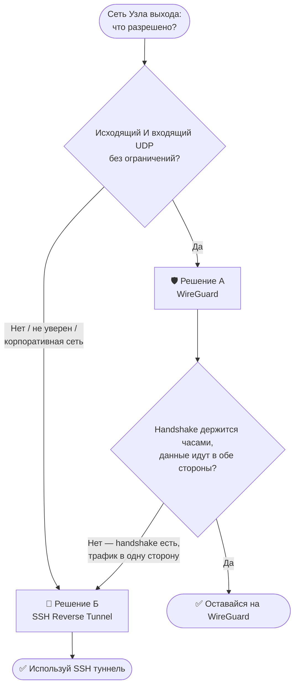
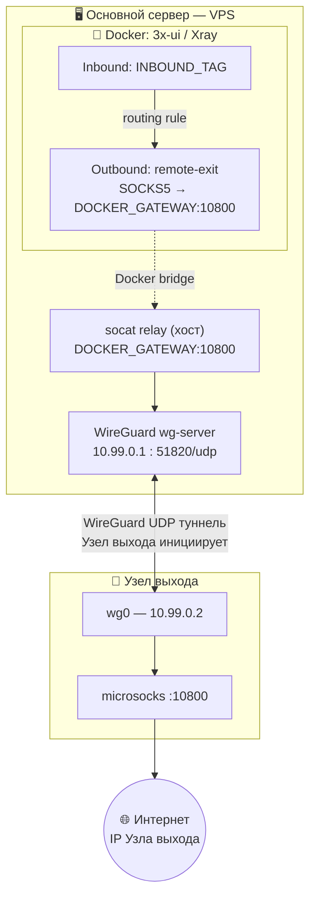
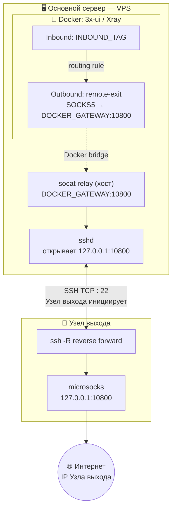
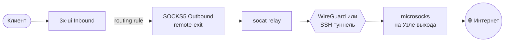
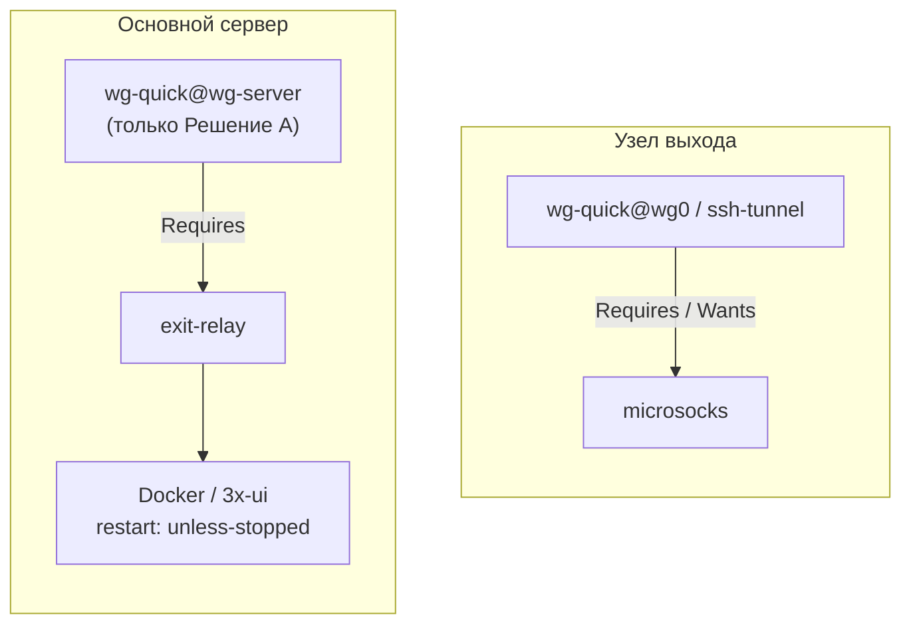

<div align="center">

# 🔀 Обратный туннель для 3x-ui

**Маршрутизация трафика через удалённый узел без белого IP**

*WireGuard · SSH Reverse Tunnel · microsocks · socat · Docker · 3x-ui*

<br>

[](https://www.wireguard.com/)
[](https://www.openssh.com/)
[](https://www.docker.com/)
[](https://ubuntu.com/)
[](https://github.com/MHSanaei/3x-ui)
[](LICENSE)
[](https://github.com/)

<br>

🌐 **Язык:** [English](README.md) · Русский

</div>

---

## 📖 Описание

**Проблема:** 3x-ui работает в Docker на VPS (Основной сервер). Нужно, чтобы трафик определённых inbound выходил через другую машину (Узел выхода) — у которой **нет статического или белого IP**.

**Решение:** Узел выхода сам инициирует туннель к Основному серверу. Xray маршрутизирует выбранные inbound через `socat` relay → туннель → `microsocks` на Узле выхода.

Рассматриваются два варианта туннеля — выбирай по тому, что позволяет сеть Узла выхода:



| | Решение А · WireGuard | Решение Б · SSH Reverse |
|---|---|---|
| **Подходит для** | Домашний сервер, VPS, свободная сеть | Корпоративная сеть, NAT, жёсткий firewall |
| **Протокол** | UDP | TCP |
| **Порт на Основном сервере** | 51820/UDP | 22/TCP *(уже открыт)* |
| **Стабильность** | ★★★★★ на открытых сетях | ★★★★☆, самовосстанавливается |
| **Сложность настройки** | Средняя | Низкая |
| **Переживает строгий NAT / корп. firewall** | ❌ Часто блокируется в одну сторону | ✅ TCP handshake проходит насквозь |

> [!TIP]
> Не знаешь что выбрать? Начни с Решения А. Если `wg show` показывает handshake, но `curl` через туннель зависает по таймауту — а `tcpdump` на Узле выхода показывает **ноль входящих пакетов** — сеть разрешает исходящий UDP, но блокирует обратный трафик. Это характерный признак корпоративного firewall, блокирующего трафик в одну сторону. Сразу переходи к Решению Б ниже.

---

## 🏗️ Архитектура

### Решение А — WireGuard



### Решение Б — SSH Reverse Tunnel



### Путь трафика (для обоих решений)



> [!NOTE]
> Оба решения используют идентичную конфигурацию Docker / socat / 3x-ui — отличается только транспорт туннеля (UDP vs TCP). Это намеренно: позволяет мигрировать между ними не трогая 3x-ui вообще.

---

## ✅ Требования

| | Основной сервер | Узел выхода |
|---|---|---|
| **ОС** | Ubuntu 22.04+ | Ubuntu 22.04+ |
| **Сеть** | Публичный IP, Docker + 3x-ui запущен | Только выход в интернет — **белый IP не нужен** |
| **Открытые порты** | 22/TCP, 443/TCP + **51820/UDP** *(только Решение А)* | Не нужны |

---

## 📋 Справочник переменных

Замени эти плейсхолдеры на реальные значения по ходу гайда:

| Переменная | Описание | Как найти |
|-----------|----------|-----------|
| `<ENTRY_SERVER_IP>` | Публичный IP основного сервера | `curl ifconfig.me` на основном сервере |
| `<DOCKER_GATEWAY>` | Gateway Docker bridge сети | `docker exec <контейнер> ip route \| grep default` |
| `<BR_IFACE>` | Имя Docker bridge интерфейса | `ip link show \| grep br-` |
| `<INBOUND_TAG>` | Тег inbound в 3x-ui | Виден в JSON конфиге Xray |
| `<EXIT_NODE_USER>` | Linux пользователь на Узле выхода | `whoami` на Узле выхода |

<details>
<summary>💡 Как найти DOCKER_GATEWAY и BR_IFACE</summary>

```bash
# DOCKER_GATEWAY — выполнить на основном сервере
docker exec <имя-контейнера-3x-ui> ip route | grep default
# Пример: default via 172.19.0.1 dev eth0
#                     ^^^^^^^^^^ = DOCKER_GATEWAY

# BR_IFACE — сопоставить по имени сети
docker network ls                                          # найти сеть compose
docker network inspect <имя-сети> | grep Subnet           # подтвердить подсеть
ip link show | grep br-                                    # br-XXXXXXXX = BR_IFACE
```

</details>

> [!IMPORTANT]
> Перед запуском **любого** systemd сервиса из этого гайда проверь три вещи на той машине, где его запускаешь: плейсхолдеры заменены на реальные значения, строка `User=` совпадает с выводом `whoami`, и пути к ключам/файлам действительно существуют. Сервис, который молча падает с `status=217/USER`, почти всегда означает что `User=` не совпадает с реальным аккаунтом — это случилось во время тестирования, см. раздел Устранение неполадок ниже.

---

## 🛡️ Решение А: WireGuard

> Используй когда Узел выхода на домашней сети, VPS или любой сети без блокировки UDP.

### А1 — Основной сервер: WireGuard сервер

```bash
sudo apt update && sudo apt install -y wireguard
```

Генерируем ключи сразу в `/etc/wireguard` от root — это полностью обходит ошибку `cd: Permission denied`, поскольку не нужно заходить (`cd`) в root-овую директорию от обычного пользователя:

```bash
wg genkey | sudo tee /etc/wireguard/server_private.key | wg pubkey | sudo tee /etc/wireguard/server_public.key
sudo chmod 600 /etc/wireguard/server_private.key

# Сохрани — нужен для Узла выхода (Шаг А2)
sudo cat /etc/wireguard/server_public.key
```

Собираем конфиг одной командой, с ключом, заранее раскрытым в переменную shell:

```bash
SERVER_PRIVKEY=$(sudo cat /etc/wireguard/server_private.key)

sudo tee /etc/wireguard/wg-server.conf > /dev/null << EOF
[Interface]
PrivateKey = ${SERVER_PRIVKEY}
Address = 10.99.0.1/24
ListenPort = 51820

[Peer]
# Заполнить после Шага А2
PublicKey = PLACEHOLDER
AllowedIPs = 10.99.0.2/32
PersistentKeepalive = 25
EOF

sudo cat /etc/wireguard/wg-server.conf   # проверить что выглядит правильно
```

> [!WARNING]
> Не оборачивай это в `sudo bash -c "cat > file << EOF ... EOF"`. Вложенный heredoc внутри двойных кавычек `bash -c` — хрупкая конструкция: случайно потерянный пробел или терминал, переформатировавший вставленный текст, может незаметно превратить `$(cat /path/to/key)` в буквальную строку вместо содержимого ключа, и WireGuard упадёт с ошибкой `Key is not the correct length or format`. Паттерн выше (сначала `VAR=$(...)`, потом `sudo tee file << EOF`) полностью избегает вложенного экранирования кавычек и используется во всём этом гайде.

```bash
sudo ufw allow 51820/udp
# Сервис пока не запускаем — нужен публичный ключ Узла выхода
```

### А2 — Узел выхода: WireGuard клиент + microsocks

```bash
sudo apt update && sudo apt install -y wireguard microsocks

wg genkey | sudo tee /etc/wireguard/client_private.key | wg pubkey | sudo tee /etc/wireguard/client_public.key
sudo chmod 600 /etc/wireguard/client_private.key

# Сохрани — скопируй на Основной сервер
sudo cat /etc/wireguard/client_public.key
```

```bash
CLIENT_PRIVKEY=$(sudo cat /etc/wireguard/client_private.key)

sudo tee /etc/wireguard/wg0.conf > /dev/null << EOF
[Interface]
PrivateKey = ${CLIENT_PRIVKEY}
Address = 10.99.0.2/24

[Peer]
PublicKey = <PUBLIC_KEY_ОСНОВНОГО_СЕРВЕРА>
Endpoint = <ENTRY_SERVER_IP>:51820
AllowedIPs = 10.99.0.1/32
PersistentKeepalive = 25
EOF

sudo nano /etc/wireguard/wg0.conf
# Заменить <PUBLIC_KEY_ОСНОВНОГО_СЕРВЕРА> и <ENTRY_SERVER_IP> на реальные значения
```

```bash
sudo tee /etc/systemd/system/microsocks.service << 'EOF'
[Unit]
Description=microsocks SOCKS5 прокси (WireGuard)
After=wg-quick@wg0.service
Requires=wg-quick@wg0.service

[Service]
ExecStart=/usr/bin/microsocks -i 10.99.0.2 -p 10800
Restart=always
RestartSec=5
User=nobody

[Install]
WantedBy=multi-user.target
EOF

sudo systemctl daemon-reload
sudo systemctl enable wg-quick@wg0 microsocks
```

### А3 — Обмен ключами

```bash
# На Основном сервере
EXIT_PUBKEY="<ВСТАВЬ_ПУБЛИЧНЫЙ_КЛЮЧ_УЗЛА_ВЫХОДА>"
sudo sed -i "s|PublicKey = PLACEHOLDER|PublicKey = ${EXIT_PUBKEY}|" /etc/wireguard/wg-server.conf
sudo cat /etc/wireguard/wg-server.conf   # проверить
```

### А4 — Запуск и проверка

```bash
# Основной сервер
sudo systemctl enable --now wg-quick@wg-server

# Узел выхода
sudo systemctl start wg-quick@wg0
sudo systemctl start microsocks
```

```bash
# Проверка с Основного сервера — оба пункта должны пройти:
sudo wg show wg-server                                             # latest handshake: недавно ✓
curl --max-time 5 --socks5 10.99.0.2:10800 https://api.ipify.org   # возвращает IP Узла выхода ✓
```

> [!WARNING]
> Один лишь handshake не гарантирует рабочий туннель. Если `curl` зависает по таймауту, запусти `sudo tcpdump -i wg0 -n` на Узле выхода и одновременно повтори `curl` с Основного сервера. **Ноль захваченных пакетов** означает что сеть пропускает исходящий WireGuard, но блокирует обратный путь — классический симптом корпоративного firewall. Не трать время на донастройку WireGuard в этой ситуации — переходи к Решению Б ниже.

### А5 — socat relay (Основной сервер)

```bash
sudo apt install -y socat

# Замени 172.19.0.1 на свой реальный <DOCKER_GATEWAY>
sudo tee /etc/systemd/system/exit-relay.service << 'EOF'
[Unit]
Description=socat: Docker bridge -> WireGuard -> microsocks Узла выхода
After=wg-quick@wg-server.service
Requires=wg-quick@wg-server.service

[Service]
ExecStart=/usr/bin/socat \
  TCP-LISTEN:10800,bind=172.19.0.1,fork,reuseaddr \
  TCP:10.99.0.2:10800
Restart=always
RestartSec=5

[Install]
WantedBy=multi-user.target
EOF

sudo systemctl daemon-reload
sudo systemctl enable --now exit-relay

ss -tlnp | grep 10800   # должно быть 172.19.0.1:10800 LISTEN
```

Как только relay слушает — переходи к разделам **UFW правило** и **Настройка 3x-ui** ниже, они общие для обоих решений.

---

## 🔑 Решение Б: SSH Reverse Tunnel

> Используй когда Узел выхода за корпоративным firewall, строгим NAT или сетью, блокирующей UDP.

`autossh` **не обязателен**. Обычный `ssh` клиент с `ServerAliveInterval`/`ServerAliveCountMax` плюс systemd-овский `Restart=always` дают то же самовосстановление с одной зависимостью меньше. `autossh` даёт преимущество только против zombie TCP-соединений, которые keepalive не обнаруживает — редкий edge case, с которым большинство сетей не сталкивается. Опциональный вариант с autossh приведён в конце раздела, если всё же хочешь его использовать.

### Б1 — Узел выхода: SSH ключ

```bash
sudo apt update && sudo apt install -y microsocks

ssh-keygen -t ed25519 -f ~/.ssh/entry_tunnel -N ""

# Сохрани — скопируй на Основной сервер (Шаг Б2)
cat ~/.ssh/entry_tunnel.pub
```

### Б2 — Основной сервер: авторизация ключа

```bash
echo "<ВСТАВЬ_ПУБЛИЧНЫЙ_КЛЮЧ_УЗЛА_ВЫХОДА>" >> ~/.ssh/authorized_keys
chmod 600 ~/.ssh/authorized_keys

# Проверить что добавился корректно
tail -1 ~/.ssh/authorized_keys
```

> [!NOTE]
> `GatewayPorts` в `sshd_config` **не нужен** — socat подключается к `127.0.0.1:10800` на том же хосте где работает `sshd`, так что проброшенный порт никогда не нужно выставлять дальше localhost.

Перед тем как продолжить, проверь соединение вручную с Узла выхода:

```bash
ssh -i ~/.ssh/entry_tunnel <ПОЛЬЗОВАТЕЛЬ_ОСНОВНОГО_СЕРВЕРА>@<ENTRY_SERVER_IP> echo ok
# Должно вывести "ok" без запроса пароля
```

### Б3 — Узел выхода: microsocks + SSH туннель

```bash
sudo tee /etc/systemd/system/microsocks.service << 'EOF'
[Unit]
Description=microsocks SOCKS5 прокси (SSH туннель)
After=network.target

[Service]
ExecStart=/usr/bin/microsocks -i 127.0.0.1 -p 10800
Restart=always
RestartSec=5
User=nobody

[Install]
WantedBy=multi-user.target
EOF
```

```bash
# Сначала узнай своего реального пользователя — понадобится ниже
whoami
```

> [!CAUTION]
> Строка `User=` ниже **обязана** совпадать с выводом `whoami` именно на этой машине, а `<ENTRY_SERVER_IP>` / `<ПОЛЬЗОВАТЕЛЬ_ОСНОВНОГО_СЕРВЕРА>` / `<EXIT_NODE_USER>` должны быть заменены на реальные значения, а не оставлены как буквальный текст плейсхолдера. Несовпадающий `User=` молча падает с `status=217/USER` в `systemctl status`, а буквальный `<ENTRY_SERVER_IP>` просто не резолвится как хост. Обе ошибки реально произошли во время тестирования.

```bash
# Замени <EXIT_NODE_USER>, <ПОЛЬЗОВАТЕЛЬ_ОСНОВНОГО_СЕРВЕРА>, <ENTRY_SERVER_IP> на реальные значения
sudo tee /etc/systemd/system/ssh-tunnel.service << 'EOF'
[Unit]
Description=SSH обратный туннель к Основному серверу
After=network.target microsocks.service
Wants=microsocks.service

[Service]
User=<EXIT_NODE_USER>
ExecStart=/usr/bin/ssh -N \
  -o "ServerAliveInterval=10" \
  -o "ServerAliveCountMax=3" \
  -o "ExitOnForwardFailure=yes" \
  -o "StrictHostKeyChecking=no" \
  -i /home/<EXIT_NODE_USER>/.ssh/entry_tunnel \
  -R 10800:127.0.0.1:10800 \
  <ПОЛЬЗОВАТЕЛЬ_ОСНОВНОГО_СЕРВЕРА>@<ENTRY_SERVER_IP>
Restart=always
RestartSec=10

[Install]
WantedBy=multi-user.target
EOF

sudo systemctl daemon-reload
sudo systemctl enable --now microsocks
sudo systemctl enable --now ssh-tunnel

# Подожди пару секунд и проверь что сервис реально работает, а не зациклился на рестартах
sleep 3 && sudo systemctl status ssh-tunnel --no-pager
```

<details>
<summary>🔧 Опционально: autossh вместо обычного ssh</summary>

Если хочешь дополнительную защиту от zombie TCP-соединений (редко, но возможно на некоторых сетях), подставь `autossh`:

```bash
sudo apt install -y autossh
```

Затем измени строку `ExecStart` на:

```ini
ExecStart=/usr/bin/autossh -M 0 -N \
  -o "ServerAliveInterval=10" \
  -o "ServerAliveCountMax=3" \
  -o "ExitOnForwardFailure=yes" \
  -o "StrictHostKeyChecking=no" \
  -i /home/<EXIT_NODE_USER>/.ssh/entry_tunnel \
  -R 10800:127.0.0.1:10800 \
  <ПОЛЬЗОВАТЕЛЬ_ОСНОВНОГО_СЕРВЕРА>@<ENTRY_SERVER_IP>
```

`-M 0` отключает собственный порт мониторинга autossh и полагается только на keepalive уровня SSH — функционально близко к обычному `ssh`, но с дополнительным watchdog'ом на уровне процесса поверх.

</details>

### Б4 — Основной сервер: socat relay

```bash
sudo apt install -y socat

# Замени 172.19.0.1 на свой реальный <DOCKER_GATEWAY>
# Цель — 127.0.0.1 (точка SSH туннеля), а не WireGuard IP
sudo tee /etc/systemd/system/exit-relay.service << 'EOF'
[Unit]
Description=socat: Docker bridge -> SSH туннель -> microsocks Узла выхода
After=network.target

[Service]
ExecStart=/usr/bin/socat \
  TCP-LISTEN:10800,bind=172.19.0.1,fork,reuseaddr \
  TCP:127.0.0.1:10800
Restart=always
RestartSec=5

[Install]
WantedBy=multi-user.target
EOF

sudo systemctl daemon-reload
sudo systemctl enable --now exit-relay

ss -tlnp | grep 10800   # должно быть 172.19.0.1:10800 LISTEN
```

### Б5 — Проверка SSH туннеля

```bash
# Основной сервер — проброшенный порт должен появиться через несколько секунд после старта ssh-tunnel
ss -tlnp | grep 10800
# Ожидаемо: 127.0.0.1:10800  LISTEN   (открыт sshd от имени Узла выхода)

curl --max-time 5 --socks5 127.0.0.1:10800 https://api.ipify.org
# ✓ Должен вернуть IP Узла выхода
```

После проверки переходи к разделам **UFW правило** и **Настройка 3x-ui** ниже, они общие для обоих решений.

---

## ⚙️ Общее: UFW правило (оба решения)

Docker контейнер не может достучаться до `<DOCKER_GATEWAY>:10800` без явного правила UFW — `deny (incoming)` блокирует это по умолчанию, даже несмотря на то что трафик идёт из «локальной» bridge сети.

```bash
docker network ls
docker network inspect <имя-сети-compose> | grep Subnet
ip link show | grep br-
```

```bash
# Замени br-XXXXXXXX на реальное имя интерфейса (<BR_IFACE>)
sudo ufw allow in on br-XXXXXXXX to 172.19.0.1 port 10800 proto tcp

sudo ufw status verbose | grep 10800
```

```bash
docker exec <контейнер-3x-ui> nc -zv 172.19.0.1 10800
# ✓ Ожидаемо: open
```

> [!NOTE]
> Не используй `docker exec <контейнер> curl --socks5 ...` для проверки. В образе 3x-ui установлен **BusyBox** `curl`/`wget`, который не поддерживает проксирование через SOCKS5 — он либо выдаёт ошибку (`unrecognized option`), либо молча подключается напрямую, полностью игнорируя прокси. В любом случае такой тест бессмысленен. `nc -zv` проверяет именно сырую TCP-доступность, что и нужно на этом этапе; SOCKS5 по-настоящему говорит сам Xray (не BusyBox), и делает это корректно как только настроены outbound и routing.

---

## ⚙️ Общее: Настройка 3x-ui (оба решения)

Идентична для обоих решений — адрес `<DOCKER_GATEWAY>:10800` не меняется независимо от того, какой туннель используется снизу.

### Добавить SOCKS5 outbound

**Исходящие → + Исходящие**

| Поле | Значение |
|------|----------|
| Протокол | `socks` |
| Тег | `remote-exit` |
| Адрес | `172.19.0.1` ← твой `<DOCKER_GATEWAY>` |
| Порт | `10800` |
| Имя пользователя / Пароль | *(оставить пустым)* |

Нажать **Создать** → **Сохранить**.

<details>
<summary>JSON эквивалент</summary>

```json
{
  "tag": "remote-exit",
  "protocol": "socks",
  "settings": {
    "servers": [{ "address": "172.19.0.1", "port": 10800, "users": [] }]
  }
}
```

</details>

### Добавить routing rule

**Конфигурации Xray → Маршрутизация → + Маршрутизация**

| Поле | Значение |
|------|----------|
| **Теги входящих** | выбери **конкретный** нужный inbound — например `inbound-1080` |
| Тег исходящего | выбери `remote-exit` |
| Остальное | *(оставить пустым)* |

Нажать **Создать** → **Сохранить** → Xray перезапустится автоматически.

> [!CAUTION]
> Пустое поле **Теги входящих** матчит **абсолютно все** inbound на сервере, а не только тот, что нужен — Xray трактует незаполненное поле как «без ограничений», а не как «ни одного». Это незаметно перенаправляет *весь* VPN-трафик клиентов через Узел выхода, включая те соединения, которые должны были оставаться напрямую. Всегда выбирай конкретный inbound явно, и дополнительно проверь, что выше в списке нет другого более широкого правила (например, catch-all с пустым полем inbound), перехватывающего трафик раньше. Порядок правил тоже важен: это правило должно стоять **выше** `direct` и `block` в списке.

<details>
<summary>JSON эквивалент</summary>

```json
{
  "type": "field",
  "inboundTag": ["inbound-1080"],
  "outboundTag": "remote-exit"
}
```

</details>

---

## ✅ Финальная проверка

```bash
# Основной сервер
sudo systemctl status exit-relay --no-pager

# Только Решение А
sudo wg show wg-server                  # latest handshake: недавно ✓

# Только Решение Б
ss -tlnp | grep 10800                   # 127.0.0.1:10800 LISTEN ✓

# Контейнер достигает relay
docker exec <контейнер-3x-ui> nc -zv 172.19.0.1 10800   # open ✓

# Сквозной тест — через целевой inbound
curl --socks5 user:pass@<ENTRY_SERVER_IP>:<ПОРТ_INBOUND> https://api.ipify.org
# ✓ Возвращает IP Узла выхода, а не Основного сервера

# Проверка здравомыслия — каждый ДРУГОЙ inbound должен по-прежнему показывать IP Основного сервера
curl --socks5 user:pass@<ENTRY_SERVER_IP>:<ПОРТ_ДРУГОГО_INBOUND> https://api.ipify.org
# ✓ Должен вернуть IP Основного сервера — если тоже возвращает IP Узла выхода,
#   смотри предупреждение про Теги входящих выше
```

---

## ♻️ Порядок запуска при ребуте



Обе стороны поднимаются автоматически при ребуте — зависимости systemd (`Requires=` / `Wants=`) обеспечивают правильный порядок без ручного вмешательства.

---

## 🛡️ Watchdog (рекомендуется для Решения А)

WireGuard сессии за NAT могут протухать после долгого простоя — `PersistentKeepalive` поддерживает поток пакетов, но некоторые корпоративные NAT всё равно сбрасывают маппинг. `restart` мгновенно решает проблему; этот cron job автоматизирует это:

```bash
# Узел выхода
sudo tee /usr/local/bin/wg-watchdog.sh << 'EOF'
#!/bin/bash
LAST=$(sudo wg show wg0 latest-handshakes | awk '{print $2}')
DIFF=$(( $(date +%s) - LAST ))
if [ "$DIFF" -gt 180 ]; then
    logger "wg-watchdog: handshake устарел (${DIFF}с), перезапуск"
    systemctl restart wg-quick@wg0
fi
EOF

sudo chmod +x /usr/local/bin/wg-watchdog.sh
(sudo crontab -l 2>/dev/null; echo "*/2 * * * * /usr/local/bin/wg-watchdog.sh") | sudo crontab -
```

> [!NOTE]
> Решению Б это не нужно — `ssh` + `ServerAliveCountMax` + systemd-овский `Restart=always` уже самовосстанавливается в течение ~30 секунд после любого разрыва, а TCP-туннель в принципе не страдает от проблемы односторонней блокировки UDP через NAT.

---

## 🔄 Миграция: WireGuard → SSH

Если тестирование показало, что сеть Узла выхода блокирует входящий UDP (handshake успешен, но `tcpdump` показывает ноль обратных пакетов) — сносим Решение А и переключаемся на Решение Б.

<details>
<summary>Команды очистки</summary>

**Основной сервер:**

```bash
sudo systemctl stop wg-quick@wg-server exit-relay
sudo systemctl disable wg-quick@wg-server exit-relay
sudo ip link delete wg-server 2>/dev/null || true
sudo rm -f /etc/wireguard/wg-server.conf \
           /etc/wireguard/server_private.key \
           /etc/wireguard/server_public.key
sudo rm -f /etc/systemd/system/exit-relay.service
sudo ufw delete allow 51820/udp
sudo systemctl daemon-reload
```

**Узел выхода:**

```bash
sudo systemctl stop wg-quick@wg0 microsocks
sudo systemctl disable wg-quick@wg0 microsocks
sudo ip link delete wg0 2>/dev/null || true
sudo rm -f /etc/wireguard/wg0.conf \
           /etc/wireguard/client_private.key \
           /etc/wireguard/client_public.key
sudo rm -f /etc/systemd/system/microsocks.service
sudo systemctl daemon-reload
```

</details>

После очистки следуй шагам Б1–Б5 выше. UFW правило и конфигурация 3x-ui остаются без изменений.

---

## 🔧 Устранение неполадок

<details>
<summary>❌ <code>cd /etc/wireguard: Permission denied</code></summary>

Директория принадлежит root (`0700`). Либо добавляй `sudo` перед каждой командой, либо — лучше — полностью избегай `cd` и пиши файлы напрямую через `sudo tee`, как показано во всём этом гайде.

</details>

<details>
<summary>❌ WireGuard падает с <code>Key is not the correct length or format</code></summary>

Это означает что в конфиге буквально записана нераскрытая строка (вроде `$(cat/etc/wireguard/...)`) вместо реального ключа — почти всегда вызвано вложенным heredoc внутри `sudo bash -c "..."` с экранированным `$`. Проверь файл:

```bash
sudo cat /etc/wireguard/wg0.conf
```

Если после `PrivateKey =` стоит что угодно, кроме base64-строки из 44 символов — пересоздай конфиг по паттерну `VAR=$(sudo cat key_file)` + `sudo tee file << EOF` из Шага А1 / А2 выше — он не подвержен этому классу ошибок.

</details>

<details>
<summary>❌ [WG] Нет handshake после нескольких минут</summary>

```bash
sudo ufw status | grep 51820              # Основной сервер: порт открыт?
ping -c3 <ENTRY_SERVER_IP>                # Узел выхода: видит ли вообще Основной сервер?
sudo cat /etc/wireguard/wg-server.conf    # Основной сервер: ключи совпадают?
sudo cat /etc/wireguard/wg0.conf          # Узел выхода: ключи совпадают?

sudo systemctl restart wg-quick@wg-server   # Основной сервер
sudo systemctl restart wg-quick@wg0         # Узел выхода
```

</details>

<details>
<summary>❌ [WG] Handshake есть, но трафик идёт только в одну сторону</summary>

Симптом: `wg show` показывает недавний handshake и *какое-то* количество байт получено на Основном сервере, но строка `transfer` на Узле выхода показывает почти ничего полученного (только начальный ответ handshake, пара сотен байт) сколько бы времени ни прошло — а `sudo tcpdump -i wg0 -n` на Узле выхода захватывает **ноль пакетов** во время теста `curl` с Основного сервера.

Это не ошибка конфигурации — это firewall на сети Узла выхода, разрешающий исходящий UDP (поэтому запрос handshake выходит и получает один ответ), но блокирующий дальнейший непрошенный входящий UDP с IP Основного сервера. Типично для корпоративных сетей со stateful firewall. Никакая настройка WireGuard со своей стороны это не исправит.

→ Мигрируй на Решение Б (см. раздел Миграция выше).

</details>

<details>
<summary>❌ [WG] Ранее рабочий туннель протух (handshake часы назад, ping не проходит)</summary>

```bash
sudo wg show wg0          # проверить возраст последнего handshake, на Узле выхода
sudo systemctl restart wg-quick@wg0
sudo wg show wg0          # handshake теперь должен показывать "X секунд назад"
```

Если это повторяется каждые несколько часов — сессия NAT/firewall протухает быстрее, чем `PersistentKeepalive` успевает её обновить. Либо установи watchdog выше для автоматического перезапуска, либо мигрируй на Решение Б, которое не страдает от этого, поскольку TCP-трекинг соединений работает иначе, чем UDP NAT-маппинги.

</details>

<details>
<summary>❌ [SSH] systemd показывает <code>status=217/USER</code></summary>

`217/USER` означает что systemd не смог переключиться на аккаунт из `User=` — почти всегда потому что такого пользователя нет именно на этой машине. Проверь:

```bash
whoami
cat /etc/systemd/system/ssh-tunnel.service | grep User=
```

Исправь строку `User=` (и соответствующий путь к ключу `/home/<user>/.ssh/...`) на реальный аккаунт, затем:

```bash
sudo systemctl daemon-reload
sudo systemctl restart ssh-tunnel
```

</details>

<details>
<summary>❌ [SSH] ssh-tunnel не подключается / "Name or service not known"</summary>

В файле сервиса остался незаменённый буквальный плейсхолдер вроде `<ENTRY_SERVER_IP>`. Проверь:

```bash
sudo cat /etc/systemd/system/ssh-tunnel.service | grep ExecStart
```

Всё, что всё ещё в `<угловых скобках>`, нуждается в реальном значении. Отредактируй, затем:

```bash
sudo systemctl daemon-reload
sudo systemctl restart ssh-tunnel
```

</details>

<details>
<summary>❌ [SSH] 127.0.0.1:10800 не слушает на Основном сервере</summary>

```bash
sudo systemctl status ssh-tunnel --no-pager
sudo journalctl -u ssh-tunnel -n 30

# Проверить SSH вручную с Узла выхода
ssh -i ~/.ssh/entry_tunnel -N -R 10800:127.0.0.1:10800 <user>@<ENTRY_SERVER_IP>
# Если падает и в интерактивном режиме — проблема в SSH-авторизации, не в systemd —
# проверь authorized_keys на Основном сервере:
cat ~/.ssh/authorized_keys | grep -c "ssh-"
```

</details>

<details>
<summary>❌ <code>nc -zv DOCKER_GATEWAY 10800</code> возвращает "Host is unreachable" из контейнера</summary>

Не хватает UFW правила — `deny (incoming)` / `deny (routed)` по умолчанию в UFW блокирует трафик из Docker bridge к хосту:

```bash
sudo ufw allow in on br-XXXXXXXX to <DOCKER_GATEWAY> port 10800 proto tcp
docker exec <контейнер> nc -zv <DOCKER_GATEWAY> 10800
```

</details>

<details>
<summary>❌ <code>docker exec ... curl --socks5 ...</code> падает или возвращает собственный IP Основного сервера</summary>

`curl`/`wget` в контейнере 3x-ui — это BusyBox, который не поддерживает `--socks5` корректно — это ожидаемо, а не признак поломки. Используй `nc -zv` для проверки сырой TCP-доступности; по-настоящему SOCKS5 нужен только самому Xray, и он делает это правильно как только outbound и routing настроены в панели.

</details>

<details>
<summary>❌ Все inbound — не только целевой — теперь выходят через Узел выхода</summary>

Поле **Теги входящих** в routing rule осталось пустым, либо выше стоит другое более широкое правило. Пустое поле в маршрутизации Xray означает «матчит всё», а не «ничего».

```bash
# Посмотреть реальный порядок правил и значения inboundTag
docker exec <контейнер> cat /usr/local/x-ui/bin/config.json | python3 -m json.tool | grep -A5 '"routing"'
```

Фикс: в 3x-ui отредактируй правило `remote-exit` и явно выбери только нужный inbound в **Теги входящих**. После этого перепроверь каждый *другой* inbound, чтобы убедиться что он по-прежнему показывает собственный IP Основного сервера.

</details>

---

## 📎 Шпаргалка

<details>
<summary>Решение А — полная последовательность команд</summary>

```bash
# ── Основной сервер ───────────────────────────────────────────
sudo apt update && sudo apt install -y wireguard socat
wg genkey | sudo tee /etc/wireguard/server_private.key | wg pubkey | sudo tee /etc/wireguard/server_public.key
sudo chmod 600 /etc/wireguard/server_private.key
SERVER_PRIVKEY=$(sudo cat /etc/wireguard/server_private.key)
sudo tee /etc/wireguard/wg-server.conf > /dev/null << EOF
[Interface]
PrivateKey = ${SERVER_PRIVKEY}
Address = 10.99.0.1/24
ListenPort = 51820
[Peer]
PublicKey = <PUBLIC_KEY_УЗЛА_ВЫХОДА>
AllowedIPs = 10.99.0.2/32
PersistentKeepalive = 25
EOF
sudo ufw allow 51820/udp
sudo systemctl enable --now wg-quick@wg-server

sudo tee /etc/systemd/system/exit-relay.service << 'EOF'
[Unit]
Description=socat relay
After=wg-quick@wg-server.service
Requires=wg-quick@wg-server.service
[Service]
ExecStart=/usr/bin/socat TCP-LISTEN:10800,bind=<DOCKER_GATEWAY>,fork,reuseaddr TCP:10.99.0.2:10800
Restart=always
[Install]
WantedBy=multi-user.target
EOF
sudo systemctl daemon-reload && sudo systemctl enable --now exit-relay
sudo ufw allow in on <BR_IFACE> to <DOCKER_GATEWAY> port 10800 proto tcp

# ── Узел выхода ───────────────────────────────────────────────
sudo apt update && sudo apt install -y wireguard microsocks
wg genkey | sudo tee /etc/wireguard/client_private.key | wg pubkey | sudo tee /etc/wireguard/client_public.key
sudo chmod 600 /etc/wireguard/client_private.key
CLIENT_PRIVKEY=$(sudo cat /etc/wireguard/client_private.key)
sudo tee /etc/wireguard/wg0.conf > /dev/null << EOF
[Interface]
PrivateKey = ${CLIENT_PRIVKEY}
Address = 10.99.0.2/24
[Peer]
PublicKey = <PUBLIC_KEY_ОСНОВНОГО_СЕРВЕРА>
Endpoint = <ENTRY_SERVER_IP>:51820
AllowedIPs = 10.99.0.1/32
PersistentKeepalive = 25
EOF
sudo tee /etc/systemd/system/microsocks.service << 'EOF'
[Unit]
Description=microsocks
After=wg-quick@wg0.service
Requires=wg-quick@wg0.service
[Service]
ExecStart=/usr/bin/microsocks -i 10.99.0.2 -p 10800
Restart=always
User=nobody
[Install]
WantedBy=multi-user.target
EOF
sudo systemctl daemon-reload
sudo systemctl enable --now wg-quick@wg0 microsocks
```

</details>

<details>
<summary>Решение Б — полная последовательность команд</summary>

```bash
# ── Узел выхода ───────────────────────────────────────────────
sudo apt update && sudo apt install -y microsocks
ssh-keygen -t ed25519 -f ~/.ssh/entry_tunnel -N ""
cat ~/.ssh/entry_tunnel.pub   # скопировать на Основной сервер

sudo tee /etc/systemd/system/microsocks.service << 'EOF'
[Unit]
Description=microsocks
After=network.target
[Service]
ExecStart=/usr/bin/microsocks -i 127.0.0.1 -p 10800
Restart=always
User=nobody
[Install]
WantedBy=multi-user.target
EOF

sudo tee /etc/systemd/system/ssh-tunnel.service << EOF
[Unit]
Description=SSH обратный туннель
After=network.target microsocks.service
Wants=microsocks.service
[Service]
User=$(whoami)
ExecStart=/usr/bin/ssh -N -o "ServerAliveInterval=10" -o "ServerAliveCountMax=3" \\
  -o "ExitOnForwardFailure=yes" -o "StrictHostKeyChecking=no" \\
  -i $HOME/.ssh/entry_tunnel -R 10800:127.0.0.1:10800 \\
  <ПОЛЬЗОВАТЕЛЬ_ОСНОВНОГО_СЕРВЕРА>@<ENTRY_SERVER_IP>
Restart=always
RestartSec=10
[Install]
WantedBy=multi-user.target
EOF
sudo systemctl daemon-reload
sudo systemctl enable --now microsocks ssh-tunnel

# ── Основной сервер ───────────────────────────────────────────
echo "<PUBLIC_KEY_УЗЛА_ВЫХОДА>" >> ~/.ssh/authorized_keys
chmod 600 ~/.ssh/authorized_keys

sudo apt install -y socat
sudo tee /etc/systemd/system/exit-relay.service << 'EOF'
[Unit]
Description=socat relay
After=network.target
[Service]
ExecStart=/usr/bin/socat TCP-LISTEN:10800,bind=<DOCKER_GATEWAY>,fork,reuseaddr TCP:127.0.0.1:10800
Restart=always
[Install]
WantedBy=multi-user.target
EOF
sudo systemctl daemon-reload && sudo systemctl enable --now exit-relay
sudo ufw allow in on <BR_IFACE> to <DOCKER_GATEWAY> port 10800 proto tcp
```

</details>

---

## ❓ Частые вопросы

**Q: Можно добавить несколько Узлов выхода для разных inbound?**
A: Да. Каждый Узел выхода получает свой туннель (отдельный WireGuard peer или отдельный SSH порт), свой `socat` relay (другой порт биндинга), свой outbound и routing rule в 3x-ui.

**Q: Можно использовать другой протокол вместо SOCKS5 для outbound?**
A: Да. Как только туннель поднят, на Узле выхода можно запустить любой прокси — Xray VLESS, Shadowsocks, HTTP CONNECT — и использовать соответствующий тип outbound в 3x-ui. `microsocks` рекомендуется за простоту: один бинарник, ноль конфигурации.

**Q: Работает ли это без Docker (Xray как обычный systemd сервис)?**
A: Да, и даже проще — полностью пропусти `socat` relay и шаг с UFW, и укажи SOCKS5 outbound напрямую на `10.99.0.2:10800` (WireGuard) или `127.0.0.1:10800` (SSH) в конфиге Xray.

**Q: Узел выхода перезагружается и получает новый IP — это что-то ломает?**
A: Нет. Узел выхода всегда сам инициирует соединение к фиксированному IP Основного сервера, так что неважно какой у него собственный IP и как часто он меняется.

**Q: Почему WireGuard «просто не заработал» в сети с доступом в интернет?**
A: Наличие исходящего доступа в интернет не гарантирует отсутствие ограничений на UDP. Многие корпоративные и CGNAT сети разрешают исходящие UDP пакеты и даже пропускают первый ответ (этого достаточно для handshake WireGuard), но блокируют дальнейший непрошенный входящий UDP от того же удалённого peer — а именно это и нужно для постоянного трафика WireGuard. TCP-туннели вроде SSH с этим не сталкиваются, потому что firewall отслеживает состояние TCP-соединения начиная с первоначального handshake.

---

## 📁 Карта файлов

```
Основной сервер
├── /etc/systemd/system/exit-relay.service     socat relay (оба решения)
├── /etc/wireguard/wg-server.conf              конфиг WireGuard сервера (Решение А)
└── ~/.ssh/authorized_keys                     ключ Узла выхода (Решение Б)

Узел выхода
├── /etc/systemd/system/microsocks.service     microsocks SOCKS5 прокси
├── /etc/wireguard/wg0.conf                    конфиг WireGuard клиента (Решение А)
├── /usr/local/bin/wg-watchdog.sh              watchdog cron скрипт (Решение А)
├── /etc/systemd/system/ssh-tunnel.service     ssh обратный туннель (Решение Б)
└── ~/.ssh/entry_tunnel                         SSH приватный ключ (Решение Б)
```

---

<div align="center">

Сделано с ☕ · Pull requests приветствуются · [Открыть Issue](https://github.com/)

</div>
